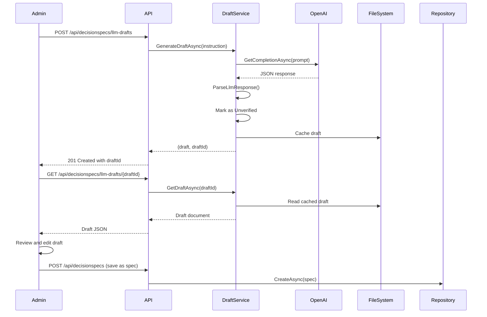

# LLM-Assisted DecisionSpec Drafting

## Overview

The DecisionSpec Management Console includes LLM-assisted draft generation to help administrators quickly create DecisionSpec documents from natural language instructions. This feature uses Azure OpenAI integration to generate structurally valid DecisionSpec JSON drafts that admins can review, edit, and save.

## Architecture

### Components

1. **DecisionSpecDraftService** (`DecisionSpark.Core/Services/DecisionSpecDraftService.cs`)
   - Orchestrates LLM draft generation
   - Manages draft caching and lifecycle
   - Handles validation and error reporting

2. **OpenAIService** (`DecisionSpark.Core/Services/OpenAIService.cs`)
   - Provides Azure OpenAI integration
   - Handles API communication and error handling
   - Shared service used across the application

3. **API Endpoints** (`DecisionSpark/Controllers/DecisionSpecsApiController.cs`)
   - `POST /api/decisionspecs/llm-drafts` - Generate new draft
   - `GET /api/decisionspecs/llm-drafts/{draftId}` - Retrieve cached draft
   - `DELETE /api/decisionspecs/llm-drafts/{draftId}` - Clear draft cache

4. **Admin UI** (`DecisionSpark/Areas/Admin/Views/DecisionSpecs/_LlmAssistModal.cshtml`)
   - Modal interface for LLM draft creation
   - Displays generation progress and draft preview
   - Hydrates edit form with generated content

## Prompt Engineering

### System Prompt

```text
You are an expert at creating DecisionSpec documents for decision routing systems. 
Generate only valid JSON with snake_case properties.
```

### User Prompt Template

The service constructs detailed prompts that include:

1. **Natural language instruction** from the admin
2. **Schema structure** with field descriptions
3. **Example JSON** showing the expected format
4. **Validation rules** and constraints

See `DecisionSpecDraftService.BuildDraftPrompt()` for the complete template.

### Best Practices for Instructions

**Effective Instructions:**
- "Create a spec for helping users choose a software development framework based on their project requirements, team size, and timeline"
- "Design a decision flow for insurance policy recommendations considering age, health status, coverage needs, and budget"
- "Build a spec to route customer support tickets based on issue category, urgency, and customer tier"

**Ineffective Instructions:**
- "Make a spec" (too vague)
- "Create something about cars" (lacks structure)
- "I need a decision tree" (wrong terminology)

**Instruction Guidelines:**
1. **Be specific** about the decision domain (e.g., "software frameworks", "insurance policies")
2. **Mention key factors** that influence the decision (e.g., "team size", "budget", "urgency")
3. **Keep under 500 words** for best results (hard limit: 2000 characters)
4. **Use business language** - avoid technical JSON terms

## Draft Lifecycle

### Generation Flow



### Draft Properties

**Metadata Flags:**
- `Unverified: true` - Marks LLM-generated content
- `Status: Draft` - Initial lifecycle state
- `CreatedBy: "LLM"` - Attribution for audit trail

**Storage:**
- Location: `Config/DecisionSpecs/drafts/`
- Filename: `DRAFT_{timestamp}_{guid}.json`
- TTL: Drafts are not auto-expired (manual cleanup via `ClearDraftAsync`)

**Validation:**
- Drafts are validated immediately after generation
- Validation errors are logged but **do not block** draft creation
- Admins must fix validation errors before saving the draft as a spec

## Safety & Governance

### Content Safety

1. **Schema Enforcement**
   - LLM responses are parsed and validated against DecisionSpec schema
   - Invalid JSON is rejected with clear error messages
   - Missing required fields are populated with sensible defaults

2. **Prompt Injection Protection**
   - User instructions are treated as data, not code
   - System prompt is fixed and cannot be overridden
   - No execution of user-provided code or scripts

3. **Output Validation**
   - FluentValidation rules applied to all generated drafts
   - Trait definitions must have valid answer_type values
   - Outcome rules must be syntactically valid expressions
   - No executable code in any field

### Human-in-the-Loop

**Mandatory Review:**
- All LLM-generated drafts are marked `Unverified: true`
- Drafts **cannot be published** until an admin explicitly saves them
- Admin UI displays clear "LLM Generated" badge on drafts
- Lifecycle transitions require manual approval (Draft → In Review → Published)

**Edit Tracking:**
- Audit log records `Action: LLMDraft` when draft is generated
- Subsequent edits by admins are tracked separately
- Success Criterion SC-003: Track edit count per draft (≥80% of drafts need <5 edits)

### Telemetry & Monitoring

**Metrics to Track (FR-014, SC-003):**

1. **Generation Metrics**
   ```
   - llm_draft_requests_total (counter)
   - llm_draft_generation_duration_ms (histogram)
   - llm_draft_generation_failures (counter)
   ```

2. **Quality Metrics**
   ```
   - llm_draft_validation_errors (counter by error code)
   - llm_draft_edit_count (histogram - SC-003)
   - llm_draft_time_to_publish (histogram)
   ```

3. **Usage Metrics**
   ```
   - llm_draft_instruction_length (histogram)
   - llm_draft_traits_generated (histogram)
   - llm_draft_outcomes_generated (histogram)
   ```

**Application Insights Queries:**

```kusto
// SC-003: Drafts requiring <5 edits
customEvents
| where name == "DecisionSpecSaved"
| where customDimensions.CreatedBy == "LLM"
| extend EditCount = toint(customDimensions.EditCount)
| summarize 
    TotalDrafts = count(),
    LowEditCount = countif(EditCount < 5),
    SuccessRate = todouble(countif(EditCount < 5)) / count() * 100
| project TotalDrafts, LowEditCount, SuccessRate
```

```kusto
// Generation performance tracking
customEvents
| where name == "LLMDraftGenerated"
| extend 
    Duration = toint(customDimensions.GenerationDurationMs),
    TraitCount = toint(customDimensions.TraitCount),
    HasErrors = tobool(customDimensions.HasValidationErrors)
| summarize 
    P50 = percentile(Duration, 50),
    P95 = percentile(Duration, 95),
    P99 = percentile(Duration, 99),
    ErrorRate = todouble(countif(HasErrors)) / count() * 100
by bin(timestamp, 1h)
```

### Error Handling

**Common Failure Modes:**

1. **OpenAI Service Unavailable**
   - Error: `InvalidOperationException: "Failed to generate draft: LLM service returned empty response"`
   - Resolution: Retry after delay, check API key and endpoint configuration
   - Logging: ERROR level with full exception details

2. **Invalid JSON Response**
   - Error: `InvalidOperationException: "LLM response is not valid JSON"`
   - Resolution: Admin can retry with clearer instruction
   - Logging: WARNING level with instruction hash for debugging

3. **Validation Failures**
   - Error: Draft created but has validation errors
   - Resolution: Admin reviews and fixes errors in UI
   - Logging: INFO level with validation error details

**Error Response Format:**

```json
{
  "type": "https://tools.ietf.org/html/rfc9110#section-15.5.1",
  "title": "Failed to generate draft",
  "status": 500,
  "detail": "Failed to generate draft: LLM service returned empty response",
  "instance": "/api/decisionspecs/llm-drafts"
}
```

## Testing Strategy

### Unit Tests

**DecisionSpecDraftServiceTests.cs:**
- `GenerateDraftAsync_WithValidInstruction_CreatesDraft`
- `GenerateDraftAsync_LlmReturnsEmpty_ThrowsInvalidOperationException`
- `GenerateDraftAsync_HandlesMarkdownCodeBlocks`
- `GetDraftAsync_WithExistingDraft_ReturnsDraft`
- `ClearDraftAsync_RemovesDraftFromCache`

**Coverage:** 11 tests covering happy path, error handling, and edge cases

### Integration Tests

**API Endpoint Testing:**
- POST /llm-drafts with valid instruction → 201 Created
- GET /llm-drafts/{id} with valid draft → 200 OK with JSON
- DELETE /llm-drafts/{id} → 204 No Content
- POST with empty instruction → 400 Bad Request

### Manual Testing Checklist

**Before Production:**
- [ ] Generate drafts for at least 5 different domains
- [ ] Verify SC-003: ≥80% of drafts need <5 edits
- [ ] Test with edge cases (very long instructions, special characters, multi-language)
- [ ] Verify audit trail logs LLMDraft action
- [ ] Confirm unverified flag prevents publishing
- [ ] Test concurrent draft generation (multiple admins)

## Configuration

### appsettings.json

```json
{
  "OpenAI": {
    "ApiKey": "***",
    "Endpoint": "https://your-resource.openai.azure.com/",
    "DeploymentName": "gpt-4",
    "MaxTokens": 2000,
    "Temperature": 0.7
  },
  "DecisionSpecs": {
    "RootPath": "Config/DecisionSpecs",
    "DraftsSubPath": "drafts"
  }
}
```

### Dependency Injection

```csharp
// Program.cs
builder.Services.AddSingleton<DecisionSpecDraftService>(sp => 
{
    var openAI = sp.GetRequiredService<IOpenAIService>();
    var repository = sp.GetRequiredService<IDecisionSpecRepository>();
    var validator = sp.GetRequiredService<IValidator<DecisionSpecDocument>>();
    var logger = sp.GetRequiredService<ILogger<DecisionSpecDraftService>>();
    var draftsPath = Path.Combine(
        builder.Configuration["DecisionSpecs:RootPath"]!,
        "drafts");
    
    return new DecisionSpecDraftService(
        openAI, repository, validator, logger, draftsPath);
});
```

## Roadmap & Future Enhancements

### Planned Improvements

1. **Iterative Refinement**
   - Allow admins to provide feedback and regenerate specific sections
   - "Refine this trait" button to improve individual questions

2. **Template Library**
   - Pre-built templates for common domains (e.g., "Product Recommendations", "Support Routing")
   - Admin can start from template + customize with LLM

3. **Batch Generation**
   - Generate multiple variations of a spec
   - A/B testing support for comparing LLM approaches

4. **Smart Defaults from Existing Specs**
   - Analyze existing Published specs to learn organization's style
   - Use few-shot learning to improve generated drafts

### Known Limitations

1. **No Real-Time Streaming**
   - Current implementation waits for full LLM response
   - Future: Server-Sent Events for progress updates

2. **Single Language Support**
   - Currently English-only prompts and generated content
   - Future: Multi-language support based on locale

3. **No Validation of Business Logic**
   - LLM cannot validate if selection_rules make business sense
   - Admin must review outcome routing logic carefully

## References

- **DecisionSpec Schema**: [data-model.md](../../specs/001-decisionspecs-crud/data-model.md)
- **API Specification**: [contracts/decision-specs.openapi.yaml](../../specs/001-decisionspecs-crud/contracts/decision-specs.openapi.yaml)
- **Success Criteria**: FR-012, FR-014, SC-003 in [spec.md](../../specs/001-decisionspecs-crud/spec.md)
- **Azure OpenAI Documentation**: https://learn.microsoft.com/en-us/azure/ai-services/openai/

---

**Last Updated**: 2025-12-27  
**Version**: 1.0  
**Owner**: DecisionSpark Team
